# Flujo actual del requerimiento de segmentación

Reconstruido desde el repositorio el 2026-07-28. Cada etapa se verificó contra
locks, manifiestos, código y artefactos, no contra la documentación previa.

La evidencia estructurada equivalente está en
`outputs/leaf_detection/requirement_review/current_flow.json`.

## Diagrama

```mermaid
flowchart TD
    S01["S01 Fuentes externas<br/>external_sources/<br/>completado"]
    S02["S02 EDA<br/>notebook + segmentation_audit<br/>completado"]
    S03["S03 Consolidación<br/>all/ 1155 img + 1224 máscaras<br/>completado"]
    S04["S04 Revisión humana<br/>16 approved / 16 exclude / 3 reanotar<br/>completado"]
    S05["S05 Cierre del padre<br/>dataset_lock c087af60<br/>ready_for_split_generation"]
    S06["S06 Splits por grupos<br/>809/173/173 · 1035 grupos<br/>ready_for_training_preflight"]
    S07["S07 Preflight local<br/>sin GPU ni Ultralytics<br/>blocked_by_missing_dependency"]
    S08["S08 Paquete cloud<br/>2.13 GB · sha 5d4d2bb6<br/>DESACTUALIZADO"]
    S09["S09 Bootstrap cloud<br/>ultralytics==8.4.104<br/>no ejecutado"]
    S10["S10 Preflight cloud<br/>GPU · pesos · forward<br/>no ejecutado"]
    S11["S11 Smoke 1 época<br/>batch 2 · mide AutoBatch<br/>no ejecutado"]
    S12["S12 Baseline<br/>150 epochs · patience 30<br/>no ejecutado"]
    S13["S13 Validación val<br/>reejecutable<br/>no ejecutado"]
    S14["S14 Test interno<br/>UNA sola vez<br/>no ejecutado"]
    S15["S15 Piloto externo<br/>cualitativo<br/>no ejecutado"]
    S16["S16 ROI congelados<br/>NO IMPLEMENTADO"]
    S17["S17 Clasificadores comparativos<br/>NO IMPLEMENTADO"]
    S18["S18 Integración<br/>baseline_full sin cambios"]
    PILOT[("Piloto retenido<br/>100 imágenes<br/>cero fugas verificadas")]

    S01 --> S02 --> S03 --> S04 --> S05 --> S06 --> S07 --> S08
    S08 --> S09 --> S10 --> S11 --> S12 --> S13 --> S14 --> S15
    S15 --> S16 --> S17 --> S18
    PILOT -.->|"nunca entra en train/val/test"| S06
    PILOT -.->|"sólo tras aprobar S14"| S15
    S12 -.->|"resume con last.pt"| S12

    classDef done fill:#DCFCE7,stroke:#16A34A,color:#14532D
    classDef todo fill:#FEF3C7,stroke:#D97706,color:#78350F
    classDef missing fill:#FEE2E2,stroke:#DC2626,color:#7F1D1D
    classDef held fill:#E0E7FF,stroke:#4F46E5,color:#312E81
    class S01,S02,S03,S04,S05,S06,S07 done
    class S09,S10,S11,S12,S13,S14,S15 todo
    class S08,S16,S17,S18 missing
    class PILOT held
```

Verde: completado y verificado. Ámbar: implementado pero no ejecutado. Rojo:
requiere acción antes de continuar o no está implementado. Azul: conjunto
retenido.

## Etapas completadas y verificadas

| Etapa | Entrada | Salida | Script | Make | Lock exigido | Fingerprint | Validación | Reanudable |
|---|---|---|---|---|---|---|---|---|
| S01 Fuentes | descargas originales | `external_sources/` | `scripts/download_datasets.sh` | — | ninguno | `3f065cdd…b913d7` | `sources_unchanged=true` | n/a |
| S02 EDA | `external_sources/` | inventario y decisión por fuente | notebook 02 + `segmentation_audit.py` | — | ninguno | `033db15c…a95ef` (2 428 archivos) | 11 bbox mezclados, 8 autointersecciones, 1 vértice repetido | sí |
| S03 Consolidación | fuentes + decisión EDA | `all/` 1 155 img + 1 155 TXT | `consolidate_leaf_segmentation_dataset.py` | — | ninguno | `c087af60…9e38c` | 13 392 lesiones excluidas, 0 duplicados, 0 fugas | sí |
| S04 Revisión humana | 35 casos con preview | 16 approved / 16 exclude / 3 reanotar | `generate_…_review_previews.py`, `lock_…_dataset.py` | — | ninguno | `d6a9898d…cddab2` | 0 pendientes, 0 contradicciones | **no** |
| S05 Cierre del padre | pool + decisiones | `dataset_lock.json` | `finalize_leaf_segmentation_dataset.py` | — | ninguno | `c087af60…9e38c` (2 318 archivos) | 1 224 anotaciones, clase única, 0 errores | no sin decisión |
| S06 Splits | `all/` congelado | `images/`+`labels/` por split | `create_leaf_segmentation_splits.py` | — | `ready_for_split_generation` | train/val/test + combinado `874b217b…1f51a` | 1 035 grupos, 0 fugas, doble reconstrucción idéntica | sí, con decisión |
| S07 Preflight local | splits | 8 JSON + config + comando | `leaf_segmentation_preflight.py` | `make leaf-segmentation-preflight` | ambos locks | recalcula los cuatro | batch 4/2/2 finito, 0 forward | sí |

## Etapas implementadas pero no ejecutadas

| Etapa | Make | Guard | Lock exigido | Artefactos previstos |
|---|---|---|---|---|
| S08 Paquete | `make leaf-segmentation-cloud-package` | ninguno (es seguro) | `verify_cloud_training_payload` | `.tar.gz` + `.sha256` + manifiesto |
| S09 Bootstrap | `make leaf-segmentation-cloud-bootstrap` | exige CUDA antes de instalar | — | `cloud_bootstrap/` |
| S10 Preflight cloud | `make leaf-segmentation-cloud-preflight` | — | payload verificado | `cloud_preflight/` |
| S11 Smoke | `make leaf-segmentation-cloud-smoke` | `CONFIRM_SEGMENTATION_SMOKE_TRAINING=1` | preflight `ready_for_smoke_training` | `smoke_summary.json`, config final |
| S12 Baseline | `make leaf-segmentation-cloud-train` | `CONFIRM_SEGMENTATION_TRAINING=1` | preflight ready + smoke passed | `yolo26n_seg_baseline/` |
| S13 Val | `make leaf-segmentation-cloud-validate` | — | `base_gate` | `val_summary.json` |
| S14 Test interno | `make leaf-segmentation-cloud-test` | — | `base_gate` | `test_summary.json` |
| S15 Piloto | `make leaf-segmentation-pilot-evaluate` | `CONFIRM_PILOT_EVALUATION=1` | test aprobado + pilot-gate | `pilot_external_evaluation/` |

## Etapas no implementadas

S16 (generación congelada de ROI), S17 (clasificadores `baseline_bbox_roi` y
`baseline_masked_roi`) y S18 (integración) no tienen código. `processing_profile`
sigue en `baseline_full` y `leaf_detection.enabled` en `false`.

## Redundancias detectadas

1. **Splits ejecutados tres veces.** `create_leaf_segmentation_splits.py`
   materializa el dataset completo por copia en dos corridas temporales de
   reproducibilidad y una tercera vez en la definitiva: unos 7 GB de escrituras
   para verificar determinismo. Las temporales podrían usar hardlink.
2. **Cuatro pasadas SHA-256 en `cloud-prepare`.** `verify-locks`, `file_rows`
   dentro del build, la generación de `checksums.sha256` y `verify_extracted`
   recorren los mismos 2.3 GB.
3. **Doble verificación del payload por corrida.** `train_mode` llama a
   `verify_cloud_training_payload` en `base_gate` y otra vez para incrustar los
   fingerprints en el resumen.
4. **Revalidación completa de polígonos.** `validate_segmentation_dataset`
   reparsea los 1 224 polígonos que `_parse_label` ya validó al generar los
   splits. Aquí la duplicación es deliberada: el preflight debe ser
   independiente del proceso que creó los datos.
5. **Dos verificadores de locks con la misma lógica.** `verify_training_locks` y
   `verify_cloud_training_payload` comparten `_split_digest` y difieren sólo en
   si exigen el árbol `all/`. La separación es correcta —el payload cloud
   excluye `all/` a propósito—, pero conviene documentarla para que nadie las
   unifique por error.

## Dependencias implícitas

- Los scripts cloud posteriores al bootstrap necesitan el intérprete de
  `.venv-cloud`. Antes de esta revisión ninguno lo activaba; ahora `lib.sh` lo
  hace cuando existe y no hay otro entorno activo.
- `run_ultralytics.py` exige `cloud_preflight/weights_manifest.json`, que sólo
  crea el preflight remoto.
- `validate.sh`, `evaluate_test.sh` y `leaf_segmentation_make.py` apuntan a la
  ruta fija `segmenter/yolo26n_seg_baseline`. Una segunda corrida con el mismo
  nombre produciría `…_baseline2` y esos tres consumidores seguirían leyendo la
  primera.
- Cuatro scripts del pipeline de datos no tienen objetivo `make`:
  consolidación, finalización, creación de splits y generación de previews. Son
  reproducibles pero requieren recordar la invocación exacta.
