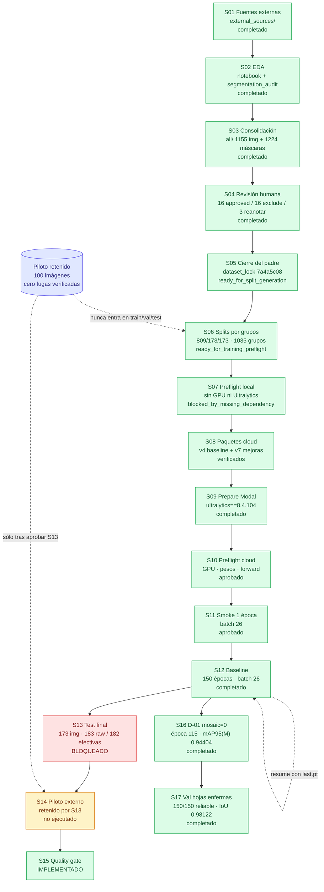

# Flujo actual del requerimiento de segmentación

Reconstruido desde el repositorio y el Volume de Modal el 2026-07-29 y
actualizado con D-01 el 2026-08-17. Cada etapa se verificó contra locks,
manifiestos, código y artefactos, no sólo contra la documentación previa.

La evidencia estructurada equivalente está en
`outputs/leaf_detection/requirement_review/current_flow.json`.

## Diagrama

Verde: completado y verificado. Ámbar: implementado pero no ejecutado. Rojo:
requiere acción antes de continuar o no está implementado. Azul: conjunto
retenido.

## Etapas completadas y verificadas

| Etapa | Entrada | Salida | Script | Make | Lock exigido | Fingerprint | Validación | Reanudable |
|---|---|---|---|---|---|---|---|---|
| S01 Fuentes | descargas originales | `external_sources/` | paquetes originales retenidos | — | ninguno | `3f065cdd…b913d7` | `sources_unchanged=true` | n/a |
| S02 EDA | `external_sources/` | inventario y decisión por fuente | notebook 02 + `segmentation_audit.py` | — | ninguno | `033db15c…a95ef` (2 428 archivos) | 11 bbox mezclados, 8 autointersecciones, 1 vértice repetido | sí |
| S03 Consolidación | fuentes + decisión EDA | `all/` 1 155 img + 1 155 TXT | `consolidate_leaf_segmentation_dataset.py` | — | ninguno | `7a4a5c08…d7d5c` | 1 reparación EOI sin pérdida, 0 duplicados, 0 fugas | sí |
| S04 Revisión humana | 35 casos con preview | 16 approved / 16 exclude / 3 reanotar | `generate_…_review_previews.py`, `lock_…_dataset.py` | — | ninguno | `d6a9898d…cddab2` | 0 pendientes, 0 contradicciones | **no** |
| S05 Cierre del padre | pool + decisiones | `dataset_lock.json` | `finalize_leaf_segmentation_dataset.py` | — | ninguno | `7a4a5c08…d7d5c` (2 319 archivos) | 1 224 anotaciones, clase única, 0 errores JPEG canónicos | no sin decisión |
| S06 Splits | `all/` congelado | `images/`+`labels/` por split | `create_leaf_segmentation_splits.py` | — | `ready_for_split_generation` | train/val/test + combinado `96833e43…c0e1` | 1 035 grupos, 0 fugas, 0 cambios de asignación | sí, con decisión |
| S07 Preflight local | splits | 8 JSON + config + comando | `leaf_segmentation_preflight.py` | `make leaf-segmentation-preflight` | ambos locks | recalcula los cuatro | batch 4/2/2 finito, 0 forward | sí |

## Etapas cloud

| Etapa | Make | Guard | Lock exigido | Artefactos previstos |
|---|---|---|---|---|
| S08 Paquete | `make leaf-segmentation-cloud-package` | v4 baseline y v7 de mejoras verificados | `verify_cloud_training_payload` | `.tar.gz` + `.sha256` + manifiesto |
| S09 Prepare | `modal run modal_training.py::prepare` | completado | paquete y SHA verificados | proyectos versionados en Volume |
| S10 Preflight cloud | `modal run modal_training.py::preflight` | aprobado antes y después del smoke | payload verificado | `cloud_preflight/` |
| S11 Smoke | `modal run modal_training.py::smoke --confirm true` | aprobado | preflight `ready_for_smoke_training` | `smoke_summary.json`, config final |
| S12 Baseline | `make leaf-segmentation-cloud-train` | completado; no repetir | preflight ready + smoke passed | `yolo26n_seg_baseline/`, `training_summary.json` |
| S13 Test final | `make leaf-segmentation-cloud-validate` | bloqueado por 183 raw/182 efectivas | fingerprint test + SHA de `best.pt` + split efectivo | `test_summary.json` sólo si todos los gates pasan |
| S14 Piloto | `make leaf-segmentation-pilot-evaluate` | no autorizado | test aprobado + pilot-gate | `pilot_external_evaluation/` |
| S16 D-01 | `make leaf-segmentation-modal-experiment MODAL_SEGMENTATION_EXPERIMENT=d01_mosaic0_seed42` | completado | v7 + preflight A10 | checkpoint, curvas y resumen D-01 |
| S17 Val enfermedades | wrapper de inferencia + métricas downstream | completado sobre `val`; no consume `test` | SHA de D-01 + manifiesto congelado | evaluación end-to-end de 150 imágenes |

## Etapa posterior

S15 conserva la selección de instancia, perfiles de máscara y quality gate en módulos
propios del segmentador. La auditoría humana puede ejecutarse sin depender de otro modelo.

D-01 es el candidato de mejora actual. S16 y S17 verifican entrenamiento y
funcionamiento sobre hojas enfermas, pero no sustituyen la repetición con semillas
7 y 1337 ni la evaluación de un solo uso sobre `test`. Consulte
[Resultados de D-01](segmentation-d01-results.md).

## Redundancias detectadas

1. **Splits ejecutados tres veces.** `create_leaf_segmentation_splits.py`
   materializa el dataset completo por copia en dos corridas temporales de
   reproducibilidad y una tercera vez en la definitiva: unos 7 GB de escrituras
   para verificar determinismo. Las temporales podrían usar hardlink.
2. **Cuatro pasadas SHA-256 en `cloud-prepare`.** `verify-locks`, `file_rows`
   dentro del build, la generación de `checksums.sha256` y `verify_extracted`
   recorren los mismos 2.3 GB.
3. **Doble verificación del payload por corrida.** `train_mode` llama a
   `verify_cloud_training_payload` en `base_gate` y otra vez para incrustar los
   fingerprints en el resumen.
4. **Revalidación completa de polígonos.** `validate_segmentation_dataset`
   reparsea los 1 224 polígonos que `_parse_label` ya validó al generar los
   splits. Aquí la duplicación es deliberada: el preflight debe ser
   independiente del proceso que creó los datos.
5. **Dos verificadores de locks con la misma lógica.** `verify_training_locks` y
   `verify_cloud_training_payload` comparten `_split_digest` y difieren sólo en
   si exigen el árbol `all/`. La separación es correcta —el payload cloud
   excluye `all/` a propósito—, pero conviene documentarla para que nadie las
   unifique por error.

## Dependencias implícitas

- Los scripts cloud posteriores al bootstrap necesitan el intérprete de
  `.venv-cloud`. Antes de esta revisión ninguno lo activaba; ahora `lib.sh` lo
  hace cuando existe y no hay otro entorno activo.
- `run_ultralytics.py` exige `cloud_preflight/weights_manifest.json`, que sólo
  crea el preflight remoto.
- `validate.sh`, `evaluate_test.sh` y `leaf_segmentation_make.py` apuntan a la
  ruta fija `segmenter/yolo26n_seg_baseline`. Una segunda corrida con el mismo
  nombre produciría `…_baseline2` y esos tres consumidores seguirían leyendo la
  primera.
- Cuatro scripts del pipeline de datos no tienen objetivo `make`:
  consolidación, finalización, creación de splits y generación de previews. Son
  reproducibles pero requieren recordar la invocación exacta.
- Ultralytics 8.4.104 deduplica etiquetas de segmentación por clase+bbox. En
  test, dos polígonos diferentes que ocupan todo el marco comparten bbox y el
  conteo efectivo cae de 183 a 182. El runner bloquea el resumen en vez de
  ocultar esa diferencia.

## Limpieza de resultados no oficiales

Se retiraron del Volume las dos evaluaciones `val`, sus predicciones, el
`test` incompleto, `val_summary.json`, el checksum derivado y el cache
`labels/test.cache`. Los checkpoints y artefactos del baseline no fueron
modificados. Localmente, `outputs/`, pesos descargados, muestras de test,
entornos y resultados remotos están excluidos por `.gitignore`.

El 2026-08-17 también se eliminaron localmente las evaluaciones diagnósticas
`d01_mosaic0_seed42_val` y `d01_mosaic0_seed42_val_conf020`. Se conservaron el
entrenamiento D-01, su resumen y
`d01_mosaic0_seed42_disease_val_pipeline` como resultado canónico actual.
También se retiraron `outputs/leaf_detection/predictions/`, que pertenecía al
clasificador, el paquete v6 reemplazado y los previews/reportes históricos de
`outputs/leaf_detection/pilot/`; la release v7 permanece disponible. Los datos
retenidos en `data/leaf_detection/pilot/` no se modificaron.

También se eliminaron `external_sources_eda/`,
`detector_dataset_consolidation/` y `detector_dataset_splits/` bajo `outputs/`.
Sólo contenían 97 MB de reportes y previews de julio; el dataset y los
manifiestos bajo `data/` permanecen intactos.
